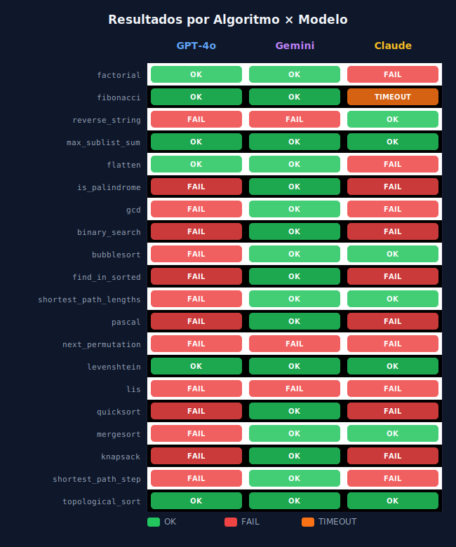
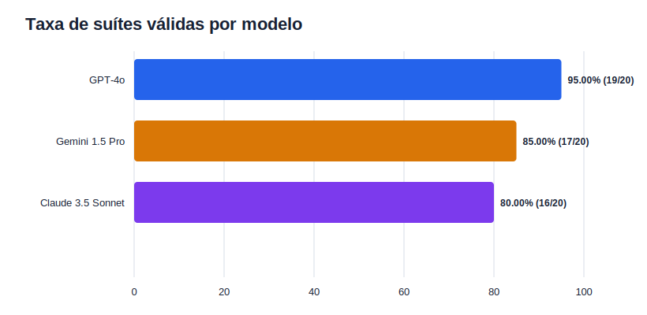
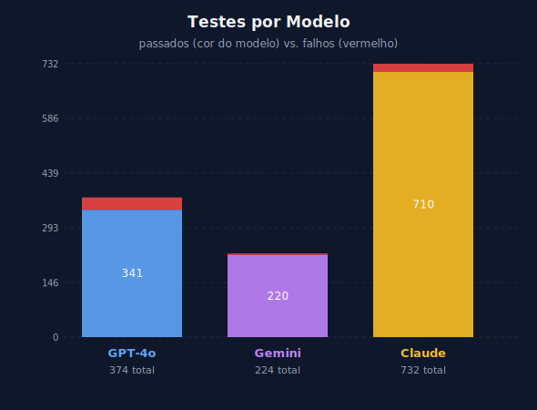
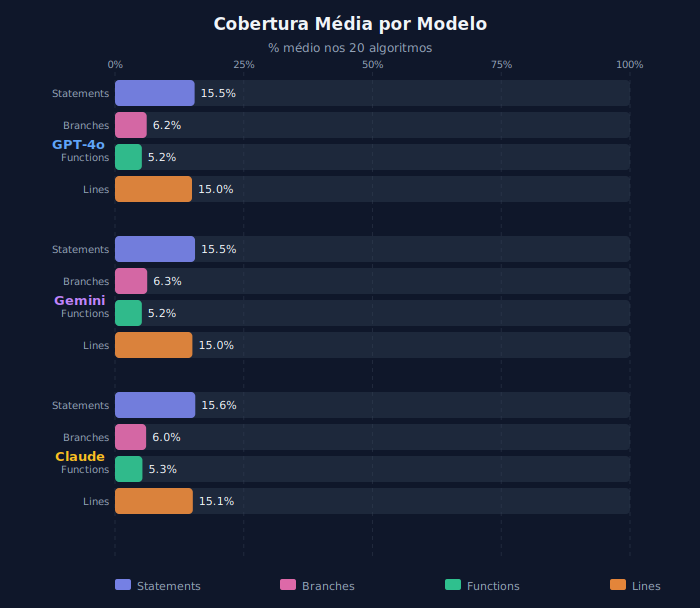
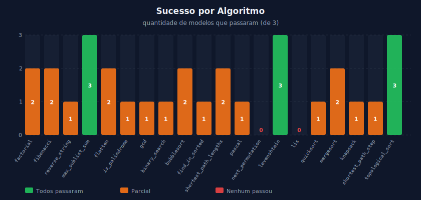

# Relatório de Experimento — LLMs e Testes Unitários

> **Gerado automaticamente em:** 05/07/2026, 23:53:12  
> **Modelos testados:** GPT-4o, Gemini, Claude  
> **Algoritmos:** 20  
> **Total de execuções:** 60

---

## 1. Resumo Executivo

| Modelo | Algoritmos OK | Algoritmos FAIL | Taxa de Sucesso | Testes Passados | Testes Falhos |
|--------|:---:|:---:|:---:|:---:|:---:|
| **GPT-4o** | 6 | 14 | 30% | 341 | 33 |
| **Gemini** | 17 | 3 | 85% | 220 | 4 |
| **Claude** | 7 | 12 | 35% | 710 | 22 |

---

## 2. Gráficos

### 2.1 Heatmap — Status por Algoritmo × Modelo

### 2.2 Taxa de Sucesso por Modelo

### 2.3 Testes Passados × Falhos por Modelo

### 2.4 Cobertura Média por Modelo

### 2.5 Sucesso por Algoritmo

---

## 3. Resultados Detalhados por Modelo

### GPT-4o

| Algoritmo | Status | Total | Passou | Falhou | Stmt% | Branch% | Func% | Lines% | Tempo (s) |
|-----------|:------:|:-----:|:------:|:------:|:-----:|:-------:|:-----:|:------:|:---------:|
| `factorial` | ✅ OK | 16 | 16 | 0 | 12.43% | 3.13% | 4.17% | 11.22% | 1.825 |
| `fibonacci` | ✅ OK | 17 | 17 | 0 | 13.51% | 6.25% | 4.17% | 11.73% | 7.239 |
| `reverse_string` | ❌ FAIL | 18 | 17 | 1 | 12.43% | 3.13% | 4.17% | 11.22% | 1.798 |
| `max_sublist_sum` | ✅ OK | 23 | 23 | 0 | 14.05% | 0.00% | 4.17% | 13.78% | 1.938 |
| `flatten` | ✅ OK | 19 | 19 | 0 | 14.05% | 3.13% | 4.17% | 14.80% | 1.824 |
| `is_palindrome` | ❌ FAIL | 23 | 22 | 1 | 13.51% | 6.25% | 4.17% | 12.76% | 1.943 |
| `gcd` | ❌ FAIL | 22 | 18 | 4 | 12.43% | 3.13% | 4.17% | 11.22% | 1.836 |
| `binary_search` | ❌ FAIL | 23 | 18 | 5 | 16.22% | 6.25% | 4.17% | 16.84% | 1.75 |
| `bubblesort` | ❌ FAIL | 19 | 17 | 2 | 16.76% | 3.13% | 4.17% | 16.84% | 1.729 |
| `find_in_sorted` | ❌ FAIL | 23 | 18 | 5 | 16.76% | 6.25% | 8.33% | 17.35% | 1.79 |
| `shortest_path_lengths` | ❌ FAIL | 16 | 15 | 1 | 15.14% | 0.00% | 4.17% | 14.29% | 1.737 |
| `pascal` | ❌ FAIL | 0 | 0 | 0 | 15.14% | 0.00% | 4.17% | 14.29% |  |
| `next_permutation` | ❌ FAIL | 20 | 18 | 2 | 17.30% | 4.69% | 4.17% | 17.35% | 1.67 |
| `levenshtein` | ✅ OK | 23 | 23 | 0 | 15.68% | 12.50% | 4.17% | 16.33% | 1.89 |
| `lis` | ❌ FAIL | 21 | 17 | 4 | 18.38% | 9.38% | 4.17% | 18.37% | 1.981 |
| `quicksort` | ❌ FAIL | 17 | 16 | 1 | 15.14% | 3.13% | 12.50% | 12.76% | 2.01 |
| `mergesort` | ❌ FAIL | 18 | 16 | 2 | 19.46% | 9.38% | 8.33% | 18.88% | 1.946 |
| `knapsack` | ❌ FAIL | 20 | 18 | 2 | 14.05% | 0.00% | 4.17% | 13.78% | 1.831 |
| `shortest_path_step` | ❌ FAIL | 18 | 15 | 3 | 16.76% | 9.38% | 4.17% | 16.84% | 1.688 |
| `topological_sort` | ✅ OK | 18 | 18 | 0 | 20.00% | 9.38% | 8.33% | 18.37% | 1.65 |

### Gemini

| Algoritmo | Status | Total | Passou | Falhou | Stmt% | Branch% | Func% | Lines% | Tempo (s) |
|-----------|:------:|:-----:|:------:|:------:|:-----:|:-------:|:-----:|:------:|:---------:|
| `factorial` | ✅ OK | 8 | 8 | 0 | 12.43% | 3.13% | 4.17% | 11.22% | 1.61 |
| `fibonacci` | ✅ OK | 9 | 9 | 0 | 13.51% | 6.25% | 4.17% | 11.73% | 1.637 |
| `reverse_string` | ❌ FAIL | 9 | 8 | 1 | 12.43% | 3.13% | 4.17% | 11.22% | 1.596 |
| `max_sublist_sum` | ✅ OK | 12 | 12 | 0 | 14.05% | 0.00% | 4.17% | 13.78% | 1.636 |
| `flatten` | ✅ OK | 11 | 11 | 0 | 14.05% | 3.13% | 4.17% | 14.80% | 1.628 |
| `is_palindrome` | ✅ OK | 12 | 12 | 0 | 13.51% | 6.25% | 4.17% | 12.76% | 1.672 |
| `gcd` | ✅ OK | 13 | 13 | 0 | 12.43% | 3.13% | 4.17% | 11.22% | 1.7 |
| `binary_search` | ✅ OK | 15 | 15 | 0 | 16.22% | 6.25% | 4.17% | 16.84% | 1.662 |
| `bubblesort` | ✅ OK | 10 | 10 | 0 | 16.76% | 3.13% | 4.17% | 16.84% | 1.945 |
| `find_in_sorted` | ✅ OK | 13 | 13 | 0 | 16.76% | 6.25% | 8.33% | 17.35% | 1.54 |
| `shortest_path_lengths` | ✅ OK | 9 | 9 | 0 | 15.14% | 0.00% | 4.17% | 14.29% | 1.689 |
| `pascal` | ✅ OK | 8 | 8 | 0 | 16.76% | 6.25% | 4.17% | 15.82% | 1.707 |
| `next_permutation` | ❌ FAIL | 13 | 11 | 2 | 17.30% | 6.25% | 4.17% | 17.35% | 1.873 |
| `levenshtein` | ✅ OK | 13 | 13 | 0 | 15.68% | 12.50% | 4.17% | 16.33% | 1.754 |
| `lis` | ❌ FAIL | 12 | 11 | 1 | 18.38% | 9.38% | 4.17% | 18.37% | 1.624 |
| `quicksort` | ✅ OK | 12 | 12 | 0 | 15.14% | 3.13% | 12.50% | 12.76% | 1.564 |
| `mergesort` | ✅ OK | 13 | 13 | 0 | 19.46% | 9.38% | 8.33% | 18.88% | 1.556 |
| `knapsack` | ✅ OK | 11 | 11 | 0 | 14.05% | 0.00% | 4.17% | 13.78% | 1.702 |
| `shortest_path_step` | ✅ OK | 11 | 11 | 0 | 16.76% | 9.38% | 4.17% | 16.84% | 1.817 |
| `topological_sort` | ✅ OK | 10 | 10 | 0 | 20.00% | 9.38% | 8.33% | 18.37% | 1.685 |

### Claude

| Algoritmo | Status | Total | Passou | Falhou | Stmt% | Branch% | Func% | Lines% | Tempo (s) |
|-----------|:------:|:-----:|:------:|:------:|:-----:|:-------:|:-----:|:------:|:---------:|
| `factorial` | ❌ FAIL | 22 | 18 | 4 | 12.43% | 3.13% | 4.17% | 11.22% | 1.975 |
| `fibonacci` | ⏱️ TIMEOUT |  |  |  | — | — | — | — | >30s |
| `reverse_string` | ✅ OK | 34 | 34 | 0 | 12.43% | 3.13% | 4.17% | 11.22% | 1.888 |
| `max_sublist_sum` | ✅ OK | 35 | 35 | 0 | 14.05% | 0.00% | 4.17% | 13.78% | 1.875 |
| `flatten` | ❌ FAIL | 39 | 38 | 1 | 14.05% | 3.13% | 4.17% | 14.80% | 2.164 |
| `is_palindrome` | ❌ FAIL | 51 | 47 | 4 | 13.51% | 6.25% | 4.17% | 12.76% | 1.946 |
| `gcd` | ❌ FAIL | 45 | 41 | 4 | 12.43% | 3.13% | 4.17% | 11.22% | 2.706 |
| `binary_search` | ❌ FAIL | 49 | 48 | 1 | 16.22% | 6.25% | 4.17% | 16.84% | 2.873 |
| `bubblesort` | ✅ OK | 37 | 37 | 0 | 16.76% | 3.13% | 4.17% | 16.84% | 2.044 |
| `find_in_sorted` | ❌ FAIL | 53 | 52 | 1 | 16.76% | 6.25% | 8.33% | 17.35% | 1.823 |
| `shortest_path_lengths` | ✅ OK | 25 | 25 | 0 | 15.14% | 0.00% | 4.17% | 14.29% | 1.876 |
| `pascal` | ❌ FAIL | 29 | 28 | 1 | 16.76% | 6.25% | 4.17% | 15.82% | 1.8 |
| `next_permutation` | ❌ FAIL | 46 | 45 | 1 | 17.30% | 6.25% | 4.17% | 17.35% | 1.93 |
| `levenshtein` | ✅ OK | 55 | 55 | 0 | 15.68% | 12.50% | 4.17% | 16.33% | 1.994 |
| `lis` | ❌ FAIL | 44 | 43 | 1 | 18.38% | 9.38% | 4.17% | 18.37% | 2.29 |
| `quicksort` | ❌ FAIL | 45 | 44 | 1 | 15.14% | 3.13% | 12.50% | 12.76% | 2.038 |
| `mergesort` | ✅ OK | 52 | 52 | 0 | 19.46% | 9.38% | 8.33% | 18.88% | 2.173 |
| `knapsack` | ❌ FAIL | 38 | 35 | 3 | 14.05% | 0.00% | 4.17% | 13.78% | 2.121 |
| `shortest_path_step` | ❌ FAIL | 0 | 0 | 0 | 0.00% | 0.00% | 0.00% | 0.00% | 7.296 |
| `topological_sort` | ✅ OK | 33 | 33 | 0 | 20.00% | 9.38% | 8.33% | 18.37% | 2.212 |

---

## 4. Análise por Algoritmo

| Algoritmo | GPT-4o | Gemini | Claude | Modelos OK |
|-----------|---|---|---|---|
| `factorial` | ✅ OK | ✅ OK | ❌ FAIL | **2/3** |
| `fibonacci` | ✅ OK | ✅ OK | ⏱️ TIMEOUT | **2/3** |
| `reverse_string` | ❌ FAIL | ❌ FAIL | ✅ OK | **1/3** |
| `max_sublist_sum` | ✅ OK | ✅ OK | ✅ OK | **3/3** |
| `flatten` | ✅ OK | ✅ OK | ❌ FAIL | **2/3** |
| `is_palindrome` | ❌ FAIL | ✅ OK | ❌ FAIL | **1/3** |
| `gcd` | ❌ FAIL | ✅ OK | ❌ FAIL | **1/3** |
| `binary_search` | ❌ FAIL | ✅ OK | ❌ FAIL | **1/3** |
| `bubblesort` | ❌ FAIL | ✅ OK | ✅ OK | **2/3** |
| `find_in_sorted` | ❌ FAIL | ✅ OK | ❌ FAIL | **1/3** |
| `shortest_path_lengths` | ❌ FAIL | ✅ OK | ✅ OK | **2/3** |
| `pascal` | ❌ FAIL | ✅ OK | ❌ FAIL | **1/3** |
| `next_permutation` | ❌ FAIL | ❌ FAIL | ❌ FAIL | **0/3** |
| `levenshtein` | ✅ OK | ✅ OK | ✅ OK | **3/3** |
| `lis` | ❌ FAIL | ❌ FAIL | ❌ FAIL | **0/3** |
| `quicksort` | ❌ FAIL | ✅ OK | ❌ FAIL | **1/3** |
| `mergesort` | ❌ FAIL | ✅ OK | ✅ OK | **2/3** |
| `knapsack` | ❌ FAIL | ✅ OK | ❌ FAIL | **1/3** |
| `shortest_path_step` | ❌ FAIL | ✅ OK | ❌ FAIL | **1/3** |
| `topological_sort` | ✅ OK | ✅ OK | ✅ OK | **3/3** |

---

## 5. Algoritmos Notáveis

### ✅ Passaram em todos os modelos
- `max_sublist_sum`
- `levenshtein`
- `topological_sort`

### ❌ Falharam em todos os modelos
- `next_permutation`
- `lis`

---

## 6. Estatísticas Descritivas

### GPT-4o

**Tempo de execução (s):** média 2.11 | mediana 1.82 | desvio-padrão 1.21 | total 40.08 | min 1.65 | max 7.24

| Cobertura | Média | Mediana | Desvio-padrão | Min | Max |
|-----------|:-----:|:-------:|:-------------:|:---:|:---:|
| Statements | 15.46% | 15.14% | 2.19 | 12.43% | 20% |
| Branches | 6.16% | 6.25% | 2.95 | 3.13% | 12.5% |
| Functions | 5.21% | 4.17% | 2.23 | 4.17% | 12.5% |
| Lines | 14.95% | 14.54% | 2.53 | 11.22% | 18.88% |

### Gemini

**Tempo de execução (s):** média 1.68 | mediana 1.67 | desvio-padrão 0.1 | total 33.6 | min 1.54 | max 1.95

| Cobertura | Média | Mediana | Desvio-padrão | Min | Max |
|-----------|:-----:|:-------:|:-------------:|:---:|:---:|
| Statements | 15.54% | 15.41% | 2.2 | 12.43% | 20% |
| Branches | 6.25% | 6.25% | 2.84 | 3.13% | 12.5% |
| Functions | 5.21% | 4.17% | 2.23 | 4.17% | 12.5% |
| Lines | 15.03% | 15.31% | 2.53 | 11.22% | 18.88% |

### Claude

**Tempo de execução (s):** média 2.37 | mediana 2.04 | desvio-padrão 1.19 | total 45.02 | min 1.8 | max 7.3

| Cobertura | Média | Mediana | Desvio-padrão | Min | Max |
|-----------|:-----:|:-------:|:-------------:|:---:|:---:|
| Statements | 15.59% | 15.41% | 2.25 | 12.43% | 20% |
| Branches | 6.04% | 6.25% | 2.9 | 3.13% | 12.5% |
| Functions | 5.33% | 4.17% | 2.32 | 4.17% | 12.5% |
| Lines | 15.11% | 15.31% | 2.52 | 11.22% | 18.88% |

---

*Relatório gerado automaticamente pelo pipeline de experimento.*

**Arquivos relacionados:**
- `resultados-compilados/resultados.json` — dados completos
- `resultados-compilados/resultados.csv` — planilha
- `estatisticas/estatisticas.json` — estatísticas descritivas
- `latex/` — tabelas para LaTeX
- `graficos/` — gráficos SVG
- `json/` — JSONs individuais do Jest (60 arquivos)
- `coverage/` — cobertura individual (60 arquivos)
- `logs/` — logs individuais de cada execução